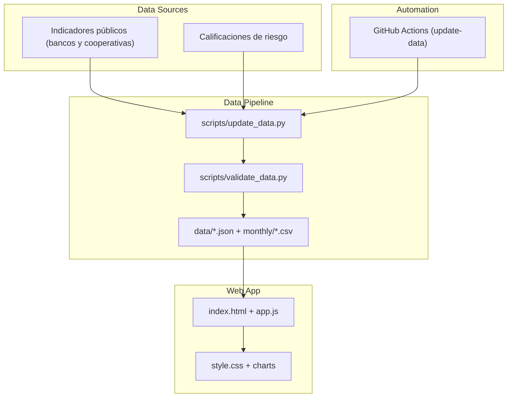

# Bancos & Cooperativas Ecuador — Comparador de Seguridad Financiera

> **Status:** `Production` · **Domain:** Fintech / Financial Education · **Last validated:** 2026

[](LICENSE)
[](https://jordanvt18.github.io/bancos-cooperativas-ecuador/)
[](scripts/update_data.py)

## 📌 Executive Summary

Aplicación web que permite comparar **bancos y cooperativas de Ecuador** con foco en seguridad
financiera y educación financiera para el público general: solvencia, morosidad, liquidez,
cobertura, rentabilidad (ROA/ROE) y calificación de riesgo. Incluye pipelines de datos
automatizados y validación, dashboards mensuales y una guía de despliegue completa.

## 🎯 Business Impact & KPIs

| Business problem | KPI optimized | Baseline | Target | Observed |
|---|---|---|---|---|
| Ciudadanía sin herramientas para evaluar instituciones financieras | Cobertura de instituciones comparables | Parcial | Amplia | **Bancos + cooperativas en un solo comparador** |
| Datos financieros dispersos y poco legibles | Actualización de datos | Manual | Automatizada | **Pipelines + validación en CI** |
| Educación financiera limitada | Comprensión de indicadores | Documentos técnicos | Interfaz amigable | **Dashboard con explicaciones** |

**Por qué importa:** decisiones financieras informadas (dónde ahorrar, dónde pedir crédito)
dependen de indicadores que hoy están dispersos. Este comparador los unifica, los explica y los
actualiza con datos auditables.

## 🧠 Methodology & Statistical Rigor

- **Hipótesis:** la seguridad financiera de una institución se comunica mejor como un conjunto de
  indicadores estandarizados y comparables que como un puntaje opaco.
- **Enfoque:** indicadores estandarizados por institución (solvencia, morosidad, liquidez,
  cobertura, ROA, ROE, calificación de riesgo) con normalización de criterios y fuentes
  documentadas; análisis mensual en `data/monthly/`.
- **Supuestos:** las fuentes públicas de indicadores son consistentes entre periodos; se documenta
  la metodología de cada indicador para el público.
- **Tests de estabilidad:** validación automática de datos (`scripts/validate_data.py`) y
  actualización programada vía GitHub Actions (`update-data-complete.yml`).

### Ecuaciones clave

Indicadores clave presentados (definición estándar):

$$\text{Solvencia} = \frac{\text{Patrimonio técnico}}{\text{Activos ponderados por riesgo}}, \qquad
\text{Rentabilidad} = \frac{\text{Resultado del ejercicio}}{\text{Activo promedio}}$$

## 🏗️ System Architecture



## 📊 Results

| Metric | Value | Detail |
|---|---|---|
| Instituciones | Bancos + cooperativas | Datos en `data/bancos.json`, `data/cooperativas.json` |
| Indicadores | 7 categorías | Solvencia, morosidad, liquidez, cobertura, ROA, ROE, calificación |
| Series mensuales | Automatizadas | `data/monthly/` vía GitHub Actions |
| Validación | Automática | `scripts/validate_data.py` |
| Despliegue | GitHub Pages | [Comparador en vivo](https://jordanvt18.github.io/bancos-cooperativas-ecuador/) |

## 🛠️ Tech Stack

| Layer | Tools |
|---|---|
| Orquestación / ETL | Python (update/validate), GitHub Actions programado |
| Frontend | HTML/JS/CSS vanilla, charts (test.csv → visualizaciones) |
| Despliegue | GitHub Pages, guía completa en `DEPLOYMENT-GUIDE-COMPLETO.md` |

## 📂 Project Structure

```
.
├── index.html              # Aplicación principal
├── app.js, style.css       # Lógica y estilos
├── data/
│   ├── bancos.json, cooperativas.json
│   ├── bancos_expandidos.json, cooperativas_expandidas.json
│   ├── indicadores_sistema.json
│   └── monthly/            # Series mensuales
├── assets/charts/          # Datos de visualización
├── scripts/                # update_data.py, validate_data.py
├── DEPLOYMENT-GUIDE-COMPLETO.md
└── .github/workflows/update-data-complete.yml
```

## 🚀 Quick Start

```bash
git clone https://github.com/jordanvt18/bancos-cooperativas-ecuador
cd bancos-cooperativas-ecuador
# 1. Actualizar datos
pip install -r requirements.txt
python scripts/update_data.py
python scripts/validate_data.py
# 2. Servir localmente
python -m http.server 8000
# → http://localhost:8000
```

**Requisitos:** Python 3.10+ para pipelines; navegador moderno para la app. Despliegue detallado en `DEPLOYMENT-GUIDE-COMPLETO.md`.

## 📈 Monitoring & Governance

- **Actualización:** job programado en GitHub Actions (`update-data-complete.yml`) que re-ejecuta extracción y validación.
- **Calidad:** validación de esquemas y rangos antes de publicar; `indicadores_sistema.json` como contrato de datos.
- **Trazabilidad:** fuentes de indicadores documentadas; series mensuales versionadas.
- **Auditoría:** app enfocada en educación financiera; los indicadores se presentan con su definición, sin puntajes opacos.
